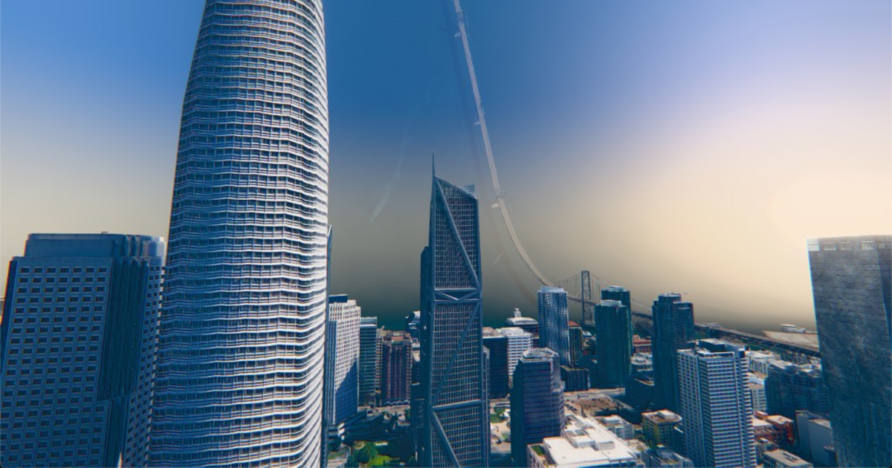

# Dreamfold

Inception meets [three.js](https://threejs.org).

**[dreamfold.netlify.app](https://dreamfold.netlify.app)** 🏙️🌀✨



*What happens when you start messing with the physics?*

I was playing with a photorealistic city in
[3d-tiles-renderer](https://github.com/NASA-AMMOS/3DTilesRendererJS)
and thought: it is all vertices. So we can do whatever we want with it.

Stand in a real street. Fold it over your head. The mesh is real, the
photographs are real — nothing moves except the bend.

I built this because I can. More ideas after [three.js conf](https://threejs.org).

Presented at CesiumJS Dev Day last week, alongside
[cinematic zoom](https://github.com/Makio64/threejs-cinematic-world-zoom).
Thanks to [Garrett Johnson](https://x.com/garrettkjohnson) and
[mrdoob](https://x.com/mrdoob) for the opportunity.

Open source — [star it on GitHub](https://github.com/Makio64/dreamfold) ⭐

- 3D Tiles Renderer by [Garrett Johnson](https://github.com/gkjohnson)
- 3D Tiles by [Cesium](https://cesium.com)
- Photorealistic tiles © Google, rendered with [three.js](https://threejs.org)

The effect is a nod to *Inception* (2010, Christopher Nolan). No footage,
assets, or code from the film are used here.

## Run it

```bash
pnpm install
pnpm dev
```

Paste a free [Cesium Ion](https://ion.cesium.com/tokens) token when the app asks.
[AGENTS.md](AGENTS.md) is how the fold is built.
